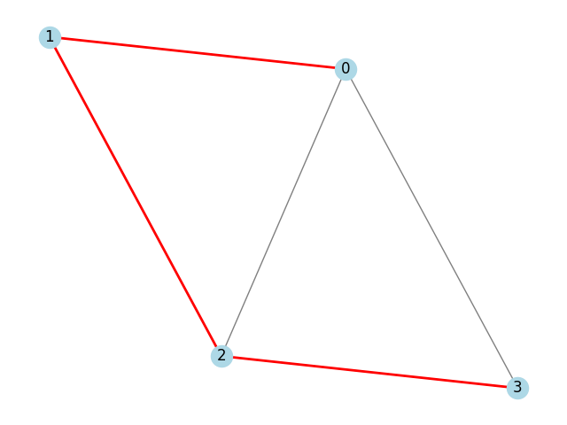

# Algoritmo para encontrar caminho hamiltoniano

Por: Maisa Pires de Andrade

## Descrição do projeto

Este projeto implementa um algoritmo em python para encontrar um **caminho hamiltoniano** em um grafo orientado ou não orientado.  
Um caminho hamiltoniano é aquele que **visita cada vértice exatamente uma vez**, sem repetições.

A abordagem utilizada é a de **backtracking**: o algoritmo tenta construir o caminho passo a passo, retrocedendo sempre que encontra um beco sem saída.

Além disso, o grafo e o caminho encontrado são visualizados usando as bibliotecas **networkx** e **matplotlib**.

---

## Estrutura do projeto

```
FPA_T3/
│
├── readme.md               # documentação do projeto
├── requirements.txt        # bibliotecas necessárias
├── assets/
│   └── grafo.png           # imagem do grafo com caminho hamiltoniano 
└── src/
    ├── main.py             # implementação do algoritmo
    └── view.py             # visualização do grafo e do caminho
```

---

## Como executar o projeto

### Requisitos

- python 3.x instalado  
- instalar as dependências com:

```bash
pip install -r requirements.txt
```

### Execução

Para executar o algoritmo e ver o caminho encontrado:

```bash
python src/main.py
```

Para gerar e visualizar o grafo com o caminho:

```bash
python src/view.py
```

A imagem será salva em `assets/grafo.png`

---

## Explicação do algoritmo

```python
def hamiltonian_path(graph, path, visited):
    if len(path) == len(graph):
        return path

    for neighbor in graph[path[-1]]:
        if not visited[neighbor]:
            visited[neighbor] = True
            path.append(neighbor)

            result = hamiltonian_path(graph, path, visited)
            if result:
                return result

            path.pop()
            visited[neighbor] = False

    return None
```

### Passo a passo

1. o algoritmo começa em um vértice inicial
2. marca esse vértice como visitado e o adiciona ao caminho
3. tenta recursivamente visitar um vizinho ainda não visitado
4. se em algum momento o caminho contém todos os vértices → caminho hamiltoniano encontrado
5. caso contrário, desfaz o último passo (backtracking) e tenta outra possibilidade

---

## Visualização com networkx

O grafo é desenhado com todos os nós e arestas  
o caminho hamiltoniano, se encontrado, é destacado em **vermelho**

imagem gerada:


---

## Relatório técnico

### Classes de complexidade

- o problema do **caminho hamiltoniano** é **np-completo**
- pertence à classe **np**: dada uma solução, podemos verificá-la em tempo polinomial
- é **np-completo** pois pode ser reduzido a partir de outros problemas np-completos (ex: caixeiro viajante)
- é **np-difícil** se buscarmos otimizar (ex: menor caminho hamiltoniano)

### Complexidade assintótica de tempo

- no pior caso, o algoritmo tenta todas as permutações dos vértices  
- isso resulta em uma complexidade de **O(n!)**, onde n é o número de vértices

#### Análise por contagem de operações

- há n! possíveis caminhos
- a cada passo, tentamos todos os vértices vizinhos não visitados
- isso leva a um crescimento fatorial

### Teorema mestre

Não aplicável diretamente, pois o algoritmo não possui uma relação de recorrência padrão (como T(n) = aT(n/b) + f(n))  
ele depende de permutação e backtracking, portanto **fora do escopo do teorema mestre**

### Análise de casos

- **pior caso**: grafo sem caminho hamiltoniano, o algoritmo explora todas as possibilidades → O(n!)
- **melhor caso**: o caminho hamiltoniano é encontrado logo no início
- **caso médio**: depende da densidade do grafo e da posição dos vértices no dicionário

---

## Conclusões

o algoritmo proposto é simples, didático e eficiente para grafos pequenos  
a visualização facilita o entendimento do caminho gerado  
por ser um problema np-completo, a abordagem de força bruta/backtracking é a mais direta para fins educacionais
